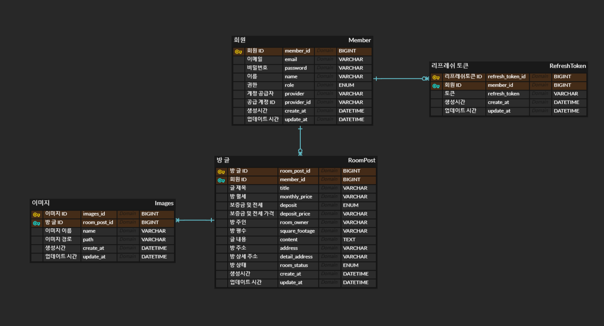

# 프로젝트 방장

- `방을 거래하는 장터`라는 의미의 이름입니다 😀
- 회원이라면 누구나 `집주인`으로 글을 작성할 수 있고 `새입자`로써 방을 확일 할 수 있습니다. 

 

---

## 개발 기간

- 2024-03-08 ~ 진행 중
- 주기적으로 업데이트 하며 느리더라도 꾸준히 작업을 이어갈 예정입니다.

 

---

## 적용 해본 기술/기능

- 테스트
    - JUnit, Mockito를 사용하여 단위 테스트를 적용

- 인증/인가
    - Session방식이 아닌 JWT를 사용하여 사용자의 인증 인가 구현
    - Spring Security를 사용해 JWT의 인증 인가를 관리
    - Outh2.0을 이용해서 소셜(google)로그인의 인증 인가를 Spring Security로 관리

- Redis
    - MySQL과 Redis를 같이 사용하여 TTL(Time To Live) 데이터는 Redis에서 관리하도록 적용

- Error/Handler
    - Error를 객체화하고  공통화하여 ErrorResponse로 관리
    - 핸들러를 사용해서 해당 Exception의 반환을 공통화

- Swagger
    - Swagger의 Response를 미리 정의 해둔 객체를 사용할 수 있도록 어노테이션 커스텀
        - <a href="https://yongjun96.github.io/posts/Rest-Docs-+-Swagger%EB%AC%B8%EC%84%9C-%EC%9E%91%EC%84%B1(@ModelAttribute,-@RequestPart-%EB%8C%80%EC%9D%91-%EB%AC%B8%EC%A0%9C)/" target="_blank">epages의 restdocs-api-spec에서 Swagger로 돌아온 이유</a>
- Infra
    - Jenkins가 아닌 GitHub Actions를 사용해서 파이프 라인 구성
        - <a href="https://yongjun96.github.io/posts/Github-ACtions%EC%9C%BC%EB%A1%9C-EC2-%EB%B0%B0%ED%8F%AC-%EC%9E%90%EB%8F%99%ED%99%94-%ED%95%98%EA%B8%B0/" target="_blank">GitHub Actions 배포 자동화 적용기</a>
    - Docker와 Docker-compose를 사용해서 컨테이너 환경 구축
    - Submodule을 사용한 민감 정보 관리
    - Route53으로 DNS 적용
    - Elastic Load Balancer를 이용해 SSL/TLS 적용
    - RDS (MySql 8.0) 사용
    - S3와 CloudFront로 정적 웹페이지 배포

 

---

 

### 서비스 확인하기

- <a href="https://api.yongjun.store/health" target="_blank">AIP 도메인(healthCheck) 확인해 보기</a>
- <a href="https://api.yongjun.store/swagger-ui/index.html" target="_blank">Swagger 확인해 보기</a>
- <a href="https://yongjun.store/" target="_blank">방장 바로가기</a>

 

### 그 외

- <a href="https://yongjun96.github.io" target="_blank">yongjun-Blog 바로가기</a>
- <a href="https://github.com/yongjun96/yogjun-store-vue" target="_blank">yongjun-store-vue 바로가기</a>

 

--- 

 

### 해당 프로젝트에 사용된 기술 목록 😉

 

#### 프로젝트 구성

- 프레임워크 : `Spring Boot 3.2.3`, `Spring Framework`
- API 아키텍처 : `REST API`
- 언어 : `Java 17`
- 빌드 : `Gradle 8.5`
- 웹 서버 : `Apache`
- 문서 `Swagger`
- CI/CD : `Github Actions`
- 보안 : `Spring Security 6.2.2`, `JWT`, `oauth2`
- ORM 및 쿼리 라이브러리 : `Jpa`, `QureyDsl`
- 테스트 : `Junit5`, `Assertj`, `Mockito`
- RDBMS : `MySql`
- InMemory : `Redis`, `H2`

 

#### AWS

- 인스턴스 : `EC2(Centos)`
- DNS : `Route53`
- SSL/TLS : `ELB(Elastic Load Balancer)`
- RDS : `MySql 8.0`
- 정적 저장소 : `S3`
- Repository : `ECR`

 

#### 컨테이너 관리 도구

- `Docker`
- `Docker Compose`

 

---

 

### ERD 구성 👀

 

 

※ `BaseTimeEntity`를 상속받아 `생성 시간`과 `업데이트 시간`을 관리 합니다.  
※ `RefreshToken`을 사용해 사용자의 `Token`을 갱신시키도록 합니다.

 

---

### 아키텍처

 

 

- `yongjun-store-vue`와 `yongjun-store`를 포함한 전체적인 방장 아키텍처입니다.

 

- `yongjun-store`의 `백엔드 API` 아키텍처입니다.

